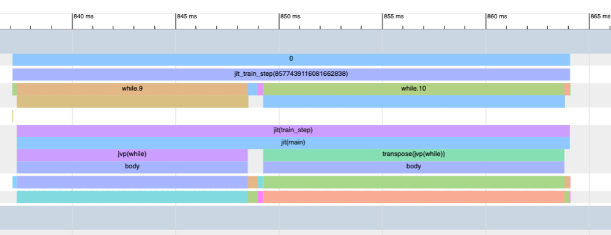
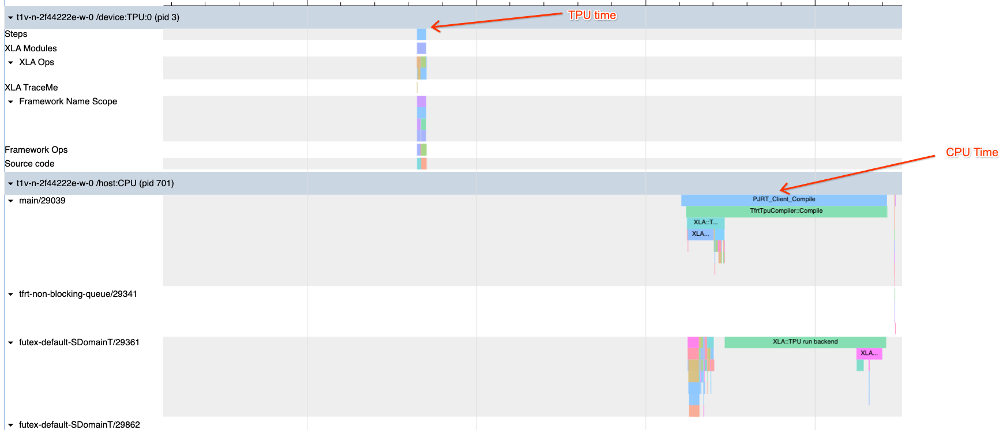
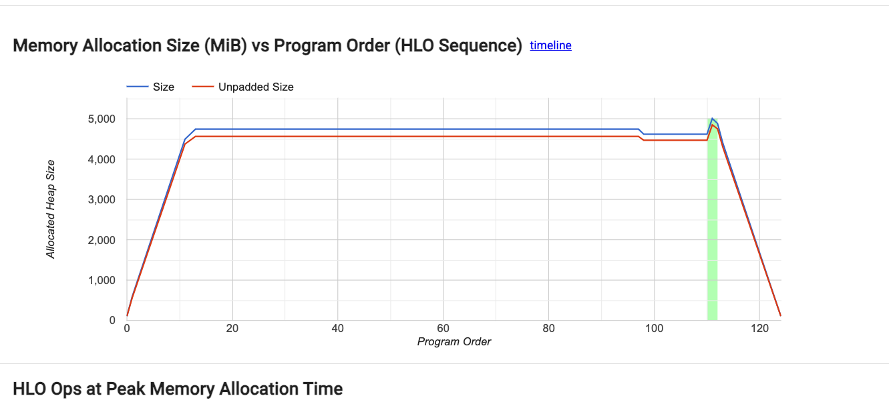
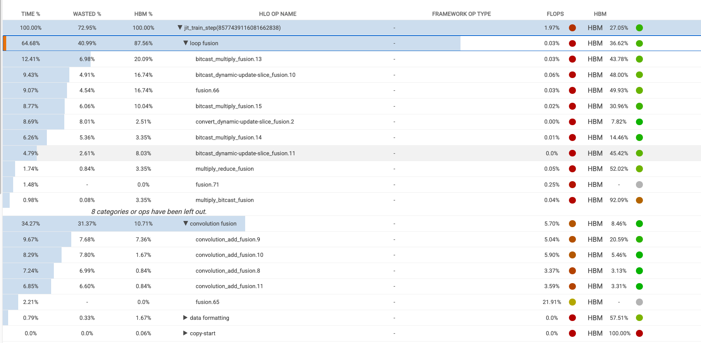

# How to debug host to device transfer for TPU

This note takes a jax sample implementation of RNN
training, and run it on TPUs.

Initial script is located at `rnn_jax_initial.py`. Running this script on a v6e TPU host
it printed:


```
2025-01-31 01:51:08.474474: W external/xla/xla/python/guard_lib.cc:115] host-to-device transfer:
2025-01-31 01:51:08.474606: W external/xla/xla/python/guard_lib.cc:115] host-to-device transfer:
2025-01-31 01:51:08.474654: W external/xla/xla/python/guard_lib.cc:115] host-to-device transfer:
2025-01-31 01:51:08.474671: W external/xla/xla/python/guard_lib.cc:115] host-to-device transfer:
...
0.9778540134429932 s 3911.416053771973 us/sample 102.26475386433518 MB/s
...
2025-01-31 01:51:08.474474: W external/xla/xla/python/guard_lib.cc:115] host-to-device transfer:
2025-01-31 01:51:08.474606: W external/xla/xla/python/guard_lib.cc:115] host-to-device transfer:
2025-01-31 01:51:08.474654: W external/xla/xla/python/guard_lib.cc:115] host-to-device transfer:
2025-01-31 01:51:08.474671: W external/xla/xla/python/guard_lib.cc:115] host-to-device transfer:
...
9.655803442001343 s 38623.21376800537 us/sample 10.356465994845598 MB/s
```

So we observe 2 things:

1. the throughput seems pretty low.
2. There are a bunch host-to-device messages, printed out thanks to 
   `with jax.transfer_guard("log"):`

The task here is to debug and figure out what is going on.


## Step 1: get a baseline

One way to get a baseline is to run similar workloads on GPU and to see what happens.
So I asked gemini to translate this code to `PyTorch` (which is `rnn_pytorch.py` in 
this folder). Then, run it on a NVidia L4 VM.

Running it on L4 yields:

```
0.5821335315704346 s 2328.5341262817383 us/sample 343.5637858902502 MB/s Loss: 0.9861007332801819
```
So I know what on v6e we should expect much better given the stats of L4 gpu vs. v6e TPU. 

## Step 2. Make sure model weights are on TPU before training

The slowness of TPU result presumably has to do with extra host-to-device transfer,
so let's fix that.

First let's understand why there possible reasons for host-to-device transfer at all.
From https://jax.readthedocs.io/en/latest/faq.html#faq-data-placement it says that an
`jax.Array` can either be uncommited on a device, or commited on a device. And commited
Array can't move by themselves. The way to get a committed Array is to use device_put.

So I added these lines to make sure that the model's state are on TPU:

```python
  device = jax.devices()[0]
  model_state = nnx.state(model)
  model_state = jax.device_put(model_state, device)
  nnx.update(model, model_state)
```

Notice that the `jax.device_put` call can take any PyTree of Jax Arrays, not just a 
single jax array. Learn about pytree here: https://jax.readthedocs.io/en/latest/pytrees.html

Optimizer states should follow with model states, so I didn't do that for the optimizer.
To make sure, I added code to print out the devices of all the state of both
model and optimizer, and confirmed that they are indeed on TPU.

However, running the script still shows host-to-device transfer.

## Step 3: Make sure data movement are excluded.

Yes, one of the reason is that the training data (fake data) are on CPU initially, 
so we need to also do that.

Then, to make sure that the `train_step` call itself doesn't have host to device
transfer, can measure by moving the `jax.transfer_guard` to only wrap `train_step`.
After that, we want to manually `device_put` the input data to TPU, outside of
train_step.

After that, all the host-to-device logs are gone!

However, the runtime we still have 

```
0.7403600249999727 s 2961.4400999998907 us/sample 135.0694211238697 MB/s
2025-01-31 03:41:09.230905: E external/local_xla/xla/stream_executor/cuda/cuda_fft.cc:477] Unable to register cuFFT factory: Attempting to register factory for plugin cuFFT when one has already been registered
WARNING: All log messages before absl::InitializeLog() is called are written to STDERR
E0000 00:00:1738294869.240334   13208 cuda_dnn.cc:8310] Unable to register cuDNN factory: Attempting to register factory for plugin cuDNN when one has already been registered
E0000 00:00:1738294869.242983   13208 cuda_blas.cc:1418] Unable to register cuBLAS factory: Attempting to register factory for plugin cuBLAS when one has already been registered
batch_size=25
0.28683516
3.991404675999547 s 15965.618703998187 us/sample 25.053836460457998 MB/s
```

## Step 4: Look at the individual compile time

At this point, one might want to look at the profiler graphs, and that is 
a good idea.

We already logged profiles to `/tmp/jax-trace` so we can visualize them in tensorboard.

To do that, we run
```
tensorboard --logdir /tmp/jax-trace/ --port 7777
```

and point browser to `localhost:7777`.

We got the following trace on device:



Hovering the mouse on it shows that one step is **26ms**.

Again to get a reference let's go back to the GPU pytorch example, and add the logging
to measure one step:

```
step time is 53.5781135559082
step time is 54.09849548339844
step time is 53.692222595214844
step time is 53.66902542114258
step time is 53.58777618408203
step time is 53.59190368652344
step time is 54.30780792236328
step time is 53.387840270996094
step time is 53.65001678466797
step time is 53.78643035888672
0.5821335315704346 s 2328.5341262817383 us/sample 343.5637858902502 MB/s Loss: 0.9861007332801819
```

Here looks like on GPU, the step time is longer, but somehow the total throughput is 
higher.

Zooming out on profile:


We can see that the compile time (on CPU actually is much larger). Unfortunately, the line up between CPU and TPU profiles is not well. 

Remembering that
in Jax, the first time (some times can be the first few times, because some property
of the input changed) the function is compile first.

To be precise on measuring compile time, we need to run more iterations, and also 
print out step time as measured in code. 

After that we can see that, the first 2 times the step time is slow, then it becomes
fast.

```
train_step: 0.751686363000772
0.27717757
0.7522107929999038 s 3008.843171999615 us/sample 132.94145860522474 MB/s
2025-01-31 04:43:34.771593: E external/local_xla/xla/stream_executor/cuda/cuda_fft.cc:477] Unable to register cuFFT factory: Attempting to register factory for plugin cuFFT when one has already been registered
WARNING: All log messages before absl::InitializeLog() is called are written to STDERR
E0000 00:00:1738298614.780496   29039 cuda_dnn.cc:8310] Unable to register cuDNN factory: Attempting to register factory for plugin cuDNN when one has already been registered
E0000 00:00:1738298614.783039   29039 cuda_blas.cc:1418] Unable to register cuBLAS factory: Attempting to register factory for plugin cuBLAS when one has already been registered
batch_size=25
train_step: 0.7438719229994604
0.28683516
3.957654158999503 s 15830.616635998014 us/sample 25.26749331358454 MB/s
batch_size=25
train_step: 0.028431627000827575
0.228615
0.028953676999663003 s 115.81470799865201 us/sample 3453.7927601100173 MB/s
batch_size=25
train_step: 0.02798857700145163
0.10568461
0.028392706999511574 s 113.5708279980463 us/sample 3522.031203355152 MB/s
batch_size=25
train_step: 0.027953455999522703
0.1442467
0.028312006001215195 s 113.24802400486078 us/sample 3532.0704578724603 MB/s
```

The step time of 0.027s matches the 26ms time we see in the profiler.

Now, is the result reasonable now?

## Comparison

Let's compare with the [L4 spec](https://www.nvidia.com/en-us/data-center/l4/) and 
[v6e spec](https://cloud.google.com/tpu/docs/v6e)

  | hardware | Compute (TFLOPS) | Memory Bandwidth (GB/s) | RNN Throughput (MB/s) |
|---|---|---|---|
| L4 | 242 | 300 | 343 |
| v6e | 918 | 1640 | 3532 |

So the numbers we have gotten seems about right.

## Aside: what else is there in tensorboard

Other tabs I often look are:
1. Memory viewer:

this view tells me how much memory I used and how large I can further increase batch size.

2. Op Profile


this view tells me what ops are consumes the total time, and if I am compute or
memory or communication bound.
